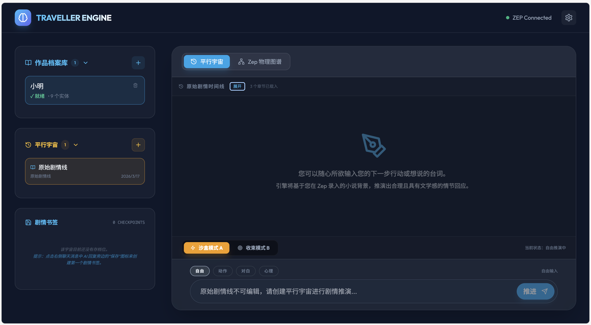

# 穿越者引擎 (Traveller Engine)

基于大语言模型（LLM）与智能上下文记忆系统（Zep）的泛沉浸式小说内容消费与二次创作平台。

## 项目愿景

打破传统小说"作者写、读者看"的单向传递模式，将读者转化为"亲历者"或"变量"，允许用户以第一视角（角色扮演）或上帝视角（大纲改写）介入剧情。

## 效果预览



## 当前进度

| 里程碑 | 状态 | 说明 |
|--------|------|------|
| M1: 数据基建与知识萃取 | ✅ 已完成 | 小说解析、知识图谱可视化 |
| M2: 创作推演引擎 | 🔄 大部分完成 | Director AI、平行宇宙、节奏控制 |
| M3: 互动游玩端 | ⏳ 待开发 | 创角流程、沉浸式UI |
| M4: DM后台与闭环 | ⏳ 待开发 | 动态图谱覆写、上帝视角 |

## 核心功能

### 已实现

- **小说智能解析与知识图谱可视化**
  - 支持长篇小说文本（百万字级别）的智能切块、向量化存储
  - 自动提取人物、地点、派系、核心道具及其关系
  - 知识图谱展示人物关系网
  - 支持动态查询角色背景故事和近期经历

- **动态会话管理**
  - 每个玩家独立 Zep Session，记忆隔离
  - 剧情书签机制，随时记录关键节点
  - 平行宇宙分支，从任意节点开启新时间线

- **Director AI 双轨模式**
  - 沙盒模式：高自由度，根据世界法则自由推演
  - 收束模式：剧情路标引导，平滑回归主线
  - 结构化输出：剧情文本 + 意图解析 + 世界影响 + UI提示

- **叙事节奏控制器**
  - 自动检测剧情停滞（连续闲聊无进展）
  - 动态危机注入，推动剧情发展

- **原始剧情时间线**
  - 章节结构自动识别与展示
  - 支持从任意章节开启平行宇宙

### 规划中

- **角色创建器**：扮演原著角色或创建原创角色
- **沉浸式互动UI**：跑团风格叙事界面
- **剧情改写面板**：大纲导向的章节生成
- **动态图谱覆写**：玩家行为实时影响世界观

## 快速开始

### 环境要求
- Python 3.9+
- Node.js 16+
- Docker & Docker Compose

### 安装步骤

1. **克隆仓库**
```bash
git clone git@github.com:addingIce/traveller.git
cd traveller
```

2. **启动 Docker 服务**
```bash
cd backend
docker-compose up -d
```

3. **配置后端**
```bash
cd backend
python -m venv venv
source venv/bin/activate  # Windows 使用 venv\Scripts\activate
pip install -r requirements.txt
cp app/config.yaml.example app/config.yaml  # 配置参数
```

4. **启动后端**
```bash
python -m uvicorn app.main:app --host 0.0.0.0 --port 8088 --reload
```

5. **配置前端**
```bash
cd frontend
npm install
```

6. **启动前端**
```bash
npm run dev
```

7. **访问应用**
打开浏览器访问 http://localhost:3000

### 服务管理

使用提供的脚本管理服务：
```bash
# 查看所有服务状态
bash scripts/manage.sh status

# 启动所有服务
bash scripts/manage.sh start

# 停止所有服务
bash scripts/manage.sh stop

# 重启所有服务
bash scripts/manage.sh restart
```

## 项目结构

```
novel/
├── backend/           # 后端服务
│   ├── app/          # FastAPI 应用
│   │   ├── api/      # API 端点
│   │   ├── services/ # 业务逻辑
│   │   └── models/   # 数据模型
│   ├── scripts/      # 辅助脚本
│   └── docker-compose.yml
├── frontend/         # 前端应用
│   └── src/
│       ├── api/      # API 客户端
│       └── App.tsx   # 主应用
├── data/             # 数据目录
│   └── novels/       # 小说文本文件
└── docs/             # 项目文档
```

## 配置说明

### 后端配置 (app/config.yaml)
```yaml
# 大模型配置
llm:
  model_director: "gpt-4o"
  model_parser: "gpt-4o-mini"
  api_base: "https://api.openai.com/v1"

# Zep 配置
zep:
  api_url: "http://localhost:8000"

# Neo4j 配置
neo4j:
  uri: "bolt://localhost:7687"
  user: "neo4j"
  password: "your_password"
```

## 开发路线图

### M1: 数据基建与知识萃取 ✅
- 文本清洗与向量化管道
- 知识图谱自动提取
- 前端档案库展示

### M2: 创作推演引擎 🔄
- [x] Zep 动态 Session 管理
- [x] 剧情书签与平行宇宙分支
- [x] Director AI 双轨模式
- [x] 叙事节奏控制器
- [x] 原始剧情时间线交互
- [ ] 指令注入防御层
- [ ] 图谱变更自动触发器

### M3: 互动游玩端 ⏳
- 创角流程开发
- 沉浸式 UI 设计
- 快捷输入系统

### M4: DM后台与产品闭环 ⏳
- 动态图谱覆写机制
- 上帝视角查阅台
- 安全防护与压力测试

## 常见问题

### Q: 小说上传后一直显示"处理中"？
A: 检查 Docker 服务是否正常运行，特别是 Zep 和 Graphiti 服务。

### Q: 知识图谱显示为空？
A: 可能是实体提取还在进行中，等待几分钟后再试。可以点击"强制刷新"按钮。

### Q: Zep 无法通过浏览器访问？
A: Zep CE 是纯 API 服务，没有 Web UI 界面，这是正常的。通过本项目的前端界面操作即可。

## 贡献指南

欢迎提交 Issue 和 Pull Request！

## 许可证

Apache License 2.0

## 联系方式

- GitHub: https://github.com/addingIce/traveller
